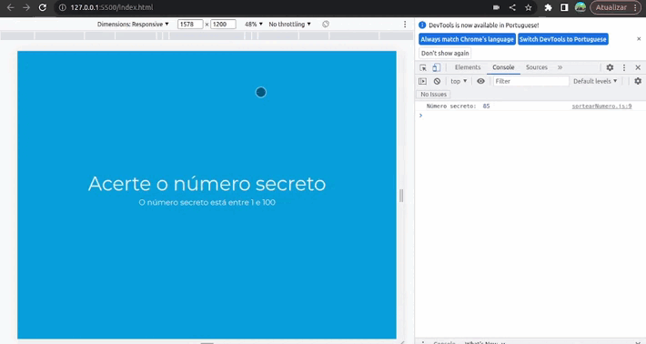

# Número Secreto

## Sobre:

O repositório "Número Secreto" é um projeto em JavaScript que implementa um jogo de adivinhação. O objetivo do jogo é que o usuário adivinhe um número secreto gerado aleatoriamente, dentro de um intervalo predefinido. O jogo continua até que o usuário acerte o número secreto.

O repositório "Número Secreto" é uma ótima oportunidade para aprimorar as habilidades de programação em JavaScript, explorando conceitos como geração aleatória de números, manipulação de entrada do usuário e lógica condicional. Além disso, é uma forma divertida de desafiar amigos e familiares a descobrir o número secreto.


## Layout:



## Como executar o projeto?

Os passos para acessar o projeto são bem simples, mas seguem a seguinte ordem:

```bash
# Terminal

git clone https://github.com/MateusMaciel340/numero-secreto

cd numero-secreto/

```

## Tecnologias

As seguintes ferramentas foram utilizadas na construção do projeto:

### Frontend

- HTML
- CSS
- JavaScript
  
## Contribuidores

<table>
    <thead>
        <tr>
            <td>
                
            </td>
        </tr>
    </thead>
    <tbody>
        <tr>
            <th>Mateus Maciel</th>
        </tr>
    </tbody>
</table>

## Como contribuir?

1. Faça um fork do projeto.
2. Crie uma nova ramificação com suas alterações: `git checkout -b minha-feature`
3. Salve as alterações e crie uma mensagem de confirmação contando o que você fez: `git commit -m "arquivo modificado"`
4. Envie suas alterações: `git push origin minha-feature`

## Licença

Este projeto é licenciado sob a licença Alura Cursos.